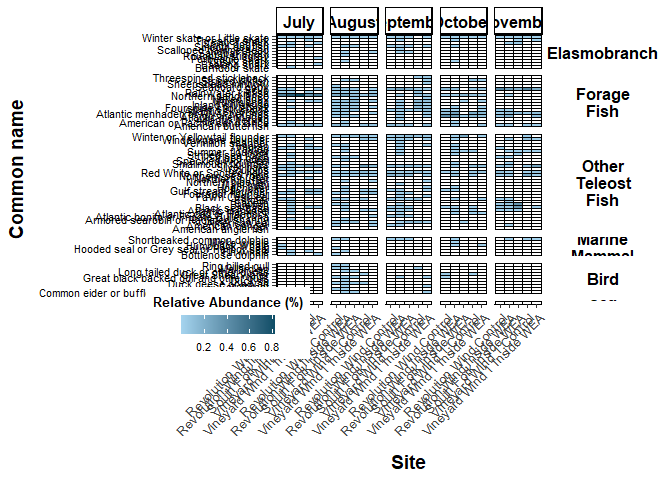

Relative abundance heatmap
================

# Load libraries

``` r
library(ggplot2) ## for plotting
library(dplyr) ## for data table manipulation
```

    ## 
    ## Attaching package: 'dplyr'

    ## The following objects are masked from 'package:stats':
    ## 
    ##     filter, lag

    ## The following objects are masked from 'package:base':
    ## 
    ##     intersect, setdiff, setequal, union

``` r
library(tidyr) ## for data table manipulation
library(readr) ## for reading in tsv files
library(readxl) ## for reading in excel files
library(stringr) ## for data transformation
library(strex) ## for data transformation
library(writexl) ## for excel output
library(purrr) ## for data transformation
library(funrar) ## for make_relative()
library(tidyverse) ## for data transformation
```

    ## ── Attaching core tidyverse packages ──────────────────────── tidyverse 2.0.0 ──
    ## ✔ forcats   1.0.0     ✔ tibble    3.2.1
    ## ✔ lubridate 1.9.3

    ## ── Conflicts ────────────────────────────────────────── tidyverse_conflicts() ──
    ## ✖ dplyr::filter() masks stats::filter()
    ## ✖ dplyr::lag()    masks stats::lag()
    ## ℹ Use the conflicted package (<http://conflicted.r-lib.org/>) to force all conflicts to become errors

``` r
library(naniar) ## replace_with_na_all function
library(cowplot) ## for plot_grid function
```

    ## 
    ## Attaching package: 'cowplot'
    ## 
    ## The following object is masked from 'package:lubridate':
    ## 
    ##     stamp

``` r
library(ggh4x) ## for facet wrap options
```

    ## 
    ## Attaching package: 'ggh4x'
    ## 
    ## The following object is masked from 'package:ggplot2':
    ## 
    ##     guide_axis_logticks

``` r
library(tidytext)
```

# Load relative abundance matrix

``` r
meta <- read_xlsx("data/metadata/full_metadata.xlsx")

data <- read_xlsx("data/results/Relative_abundance_longformat.xlsx") %>%
  mutate(across(c(rel_ab), ~ round(.x, 5)))

## creating species list for more categories
data %>% dplyr::select(Species_name, Common_name, Category) %>% distinct() %>% write_xlsx("data/results/species_list.xlsx")


data_reads <- read_xlsx("data/results/Rawreads_matrix.xlsx") %>%
  gather("sampleID", "reads", c(Aug_501_1_B:Sep_VW_S7_S)) %>%
  
  ### join with metadata
  left_join(., meta, by = "sampleID") %>%
  
  ### calculating total reads 
  group_by(SampleType, Lease_area, Depth, Month) %>%
  mutate(total_sum = sum(reads)) %>%
  
  ## sum by species name too
  group_by(SampleType, Lease_area, Depth, Month, Species_name, Common_name, Category) %>%
  
  ## sum down column by species name and sample to collapse
  mutate(spp_reads = sum(reads)) %>%
  
  ### calculating relative abundance
  mutate(rel_ab = spp_reads/total_sum)
```

    ## Warning in left_join(., meta, by = "sampleID"): Detected an unexpected many-to-many relationship between `x` and `y`.
    ## ℹ Row 4753 of `x` matches multiple rows in `y`.
    ## ℹ Row 1 of `y` matches multiple rows in `x`.
    ## ℹ If a many-to-many relationship is expected, set `relationship =
    ##   "many-to-many"` to silence this warning.

# Plots

All samples

Can this to average bottom and surface?

``` r
# data %>% replace_with_na_all(condition = ~.x == 0.00000) %>%
#   filter(!Category == "Other" & !Category == "Livestock" & !Category == "unassigned" & !Category == "Human") %>%
#   ggplot(., aes(x=Site, y=Common_name)) +
#   geom_tile(aes(fill = rel_ab), color = "black") +
#   theme_classic() +
#   labs(fill = "Relative Abundance (%)") + 
#   ylab("Common name") +
#   xlab("Sample") +
#   scale_fill_distiller(type = "seq", na.value = "white", 
#                        palette = "RdBu") + #, direction=1
#   theme(axis.text.x = element_text(angle = 45, size=8, color="black", hjust = 1),
#         legend.text = element_text(size = 8, color="black"),
#         legend.title = element_text(margin = margin(t = 0, r = 0, b = 5, l = 0), size=10, color="black", face="bold"),
#         axis.title.y = element_text(margin = margin(t = 0, r = 10, b = 0, l = 0), size=14, face="bold"),
#         axis.title.x = element_text(margin = margin(t = 10, r = 0, b = 0, l = 0), size=14, face="bold"),
#         axis.text.y = element_text(colour = 'black', size = 8),
#         legend.position = c(-0.11, -0.04),
#         legend.key.height = unit(5, 'mm'),
#         legend.direction = "horizontal",
#         legend.key.width = unit(5, 'mm'),
#         legend.title.align = 0.5,
#         legend.title.position = "top",
#         strip.text.x = element_text(color = "black", face = "bold", size = 12),
#         strip.text.y = element_text(color = "black", face = "bold", size = 12, angle=0),
#         strip.background.y = element_blank()) +
#   ### left off at switching order of month and changing color distiller to a range
#   facet_grid2(Category~factor(Month, levels = c("July", "August", "September", "October", "November")), 
#               scales = "free", space = "free", 
#              labeller = labeller(Category = label_wrap_gen(width = 10)))
# 
# ggsave("data/results/Relative_abundance.png", width = 20, height = 12)
```

Bottom sampling

``` r
data %>% 
  ### subset data
  filter(!Category == "Other" & !Category == "Livestock" & !Category == "unassigned" & !Category == "Human") %>%
  subset(Depth == "Bottom") %>%
  
  ## get rid of species with 0 counts in surface samples (ones that only show up in bottom samples)
  group_by(Species_name) %>%
  filter((sum(rel_ab) > 0)) %>% ungroup() %>%
  
  ## replace zeros with NAs for plotting
  replace_with_na_all(condition = ~.x == 0.00000) %>%
  
  ## plot
  ggplot(., aes(x=Site, y=Common_name)) +
  geom_tile(aes(fill = rel_ab), color = "black") +
  theme_classic() +
  labs(fill = "Relative Abundance (%)") + 
  ylab("Common name") +
  xlab("Site") +
  scale_fill_gradient(na.value = "white", low = "lightskyblue2", high = "#0C4D66") + #, direction=1, type = "seq", 
  theme(axis.text.x = element_text(angle = 90, size=6, color="grey25", hjust = 1),
        legend.text = element_text(size = 8, color="black"),
        legend.title = element_text(margin = margin(t = 0, r = 0, b = 5, l = 0), size=10, color="black", face="bold"),
        axis.title.y = element_text(margin = margin(t = 0, r = 10, b = 0, l = 0), size=14, face="bold"),
        axis.title.x = element_text(margin = margin(t = 10, r = 0, b = 0, l = 0), size=14, face="bold"),
        axis.text.y = element_text(colour = 'black', size = 8),
        legend.position = c(-0.11, -0.04),
        legend.key.height = unit(5, 'mm'),
        legend.direction = "horizontal",
        legend.key.width = unit(5, 'mm'),
        legend.title.align = 0.5,
        legend.title.position = "top",
        strip.text.x = element_text(color = "black", face = "bold", size = 12),
        strip.text.y = element_text(color = "black", face = "bold", size = 12, angle=0),
        strip.background.y = element_blank(),
        strip.clip = "off") +
  facet_grid2(Category~factor(Month, levels = c("July", "August", "September", "October", "November")), 
              scales = "free", space = "free", 
             labeller = labeller(Category = label_wrap_gen(width = 10))) 
```

    ## Warning: The `legend.title.align` argument of `theme()` is deprecated as of ggplot2
    ## 3.5.0.
    ## ℹ Please use theme(legend.title = element_text(hjust)) instead.
    ## This warning is displayed once every 8 hours.
    ## Call `lifecycle::last_lifecycle_warnings()` to see where this warning was
    ## generated.

    ## Warning: A numeric `legend.position` argument in `theme()` was deprecated in ggplot2
    ## 3.5.0.
    ## ℹ Please use the `legend.position.inside` argument of `theme()` instead.
    ## This warning is displayed once every 8 hours.
    ## Call `lifecycle::last_lifecycle_warnings()` to see where this warning was
    ## generated.

<!-- -->

``` r
ggsave("data/results/Heatmap_RELab_bottomsamples.png", width = 20, height = 12)
```

Surface samples

``` r
surface_bottom_sites <- data %>% filter(!is.na(Depth)) %>% subset(Depth == "Surface") %>%
  dplyr::select(Site) %>% distinct()
```

``` r
data %>% 
  ### subset data
  filter(!Category == "Other" & !Category == "Livestock" & !Category == "unassigned" & !Category == "Human") %>%
  filter(Site %in% surface_bottom_sites$Site) %>%
  
  ## get rid of species with 0 counts in surface samples (ones that only show up in bottom samples)
  group_by(Species_name) %>%
  filter(!(sum(rel_ab) == 0)) %>%
  
  ## replace zeros with NAs for plotting
  replace_with_na_all(condition = ~.x == 0.00000) %>%
  
  ## plot
  ggplot(., aes(x=Site, y=Common_name)) +
  geom_tile(aes(fill = rel_ab), color = "black") +
  theme_classic() +
  labs(fill = "Relative Abundance (%)") + 
  ylab("Common name") +
  xlab("Site") +
  scale_fill_gradient(na.value = "white", low = "lightskyblue2", high = "#0C4D66") + #, direction=1, type = "seq", 
  theme(axis.text.x = element_text(angle = 45, size=6, color="grey25", hjust = 1),
        legend.text = element_text(size = 8, color="black"),
        legend.title = element_text(margin = margin(t = 0, r = 0, b = 5, l = 0), size=10, color="black", face="bold"),
        axis.title.y = element_text(margin = margin(t = 0, r = 10, b = 0, l = 0), size=14, face="bold"),
        axis.title.x = element_text(margin = margin(t = 10, r = 0, b = 0, l = 0), size=14, face="bold"),
        axis.text.y = element_text(colour = 'black', size = 8),
        legend.position = c(-0.15, -0.04),
        legend.key.height = unit(5, 'mm'),
        legend.direction = "horizontal",
        legend.key.width = unit(5, 'mm'),
        legend.title.align = 0.5,
        legend.title.position = "top",
        strip.text.x = element_text(color = "black", face = "bold", size = 12),
        strip.text.y = element_text(color = "black", face = "bold", size = 12, angle=0),
        strip.background.y = element_blank()) +
    facet_grid2(rows = vars(Category),
              cols = vars(factor(Month, levels = c("July", "August", "September", "October", "November")), Depth),
              scales = "free", space = "free", 
              labeller = labeller(Category = label_wrap_gen(width = 10)))
```

<!-- -->

``` r
ggsave("data/results/Heatmap_RELab_surfvbottom.png", width = 17, height = 12)
```

Collapsing by lease area

``` r
## adding forage fish categories
add_category <- read_xlsx("data/results/species_list_tod.xlsx") %>% dplyr::rename(category2 = Category)


strip_col <- strip_themed(
     # Horizontal strips
     background_x = elem_list_rect(fill = c("#0f4c5c", "#e36414", "#fb8b24", "#9a031e", "#5f0f40"), alpha=0.2),
     text_x = elem_list_text(colour = c("black", "black", "black", "black", "black"),
                             face = c("bold", "bold", "bold", "bold", "bold")),
     by_layer_x = FALSE)

data_reads %>% 
  left_join(., add_category, by = c("Species_name", "Common_name")) %>%
  
  ### subset data
  filter(!Category == "Other" & !Category == "Livestock" & !Category == "unassigned" & !Category == "Human") %>% 
  subset(Depth == "Bottom") %>%
  
  group_by(Species_name) %>%
  filter(!(sum(rel_ab) == 0)) %>%
  
  ## replace zeros with NAs for plotting
  replace_with_na_all(condition = ~.x == 0.00000) %>%
  
  ## adding column for lease area x sample type 
  unite(sample_group, Lease_area, SampleType, sep = " ", remove=F) %>%
  
  ## arranging common name
  arrange(Common_name) %>%
  
  ## mutate
  mutate(Month = factor(Month, levels = c("July", "August", "September", "October", "November"))) %>%
  mutate(category2 = factor(category2, levels = c("Elasmobranch", "Forage Fish", "Other Teleost Fish", "Marine Mammal", "Bird", "Sea Turtle"))) %>%
  
  ## plot
  ggplot(., aes(x=sample_group, y=Common_name)) +
  geom_tile(aes(fill = rel_ab), color = "black") +
  theme_classic() +
  labs(fill = "Relative Abundance (%)") + 
  ylab("Common name") +
  xlab("Site") +
  scale_fill_gradient(na.value = "white", low = "lightskyblue2", high = "#0C4D66") + #, direction=1, type = "seq", 
  theme(axis.text.x = element_text(angle = 45, size=10, color="grey25", hjust = 1),
        legend.text = element_text(size = 8, color="black"),
        legend.title = element_text(margin = margin(t = 0, r = 0, b = 5, l = 0), size=10, color="black", face="bold"),
        axis.title.y = element_text(margin = margin(t = 0, r = 10, b = 0, l = 0), size=14, face="bold"),
        axis.title.x = element_text(margin = margin(t = 10, r = 0, b = 0, l = 0), size=14, face="bold"),
        axis.text.y = element_text(colour = 'black', size = 8),
        legend.position = c(-0.18, -0.07),
        legend.key.height = unit(5, 'mm'),
        legend.direction = "horizontal",
        legend.key.width = unit(5, 'mm'),
        legend.title.align = 0.5,
        legend.title.position = "top",
        strip.text.x = element_text(color = "black", face = "bold", size = 12),
        strip.text.y = element_text(color = "black", face = "bold", size = 12, angle=0),
        strip.background.y = element_blank()) +
facet_grid2(rows = vars(category2), cols = vars(Month), scales = "free",  space = "free", 
            labeller = labeller( category2 = label_wrap_gen(width = 10)))
```

<!-- -->

``` r
ggsave("data/results/Heatmap_RELab_collapsed_site.png", width = 14, height = 14)
```
