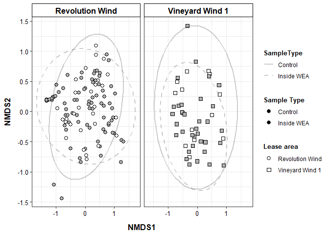
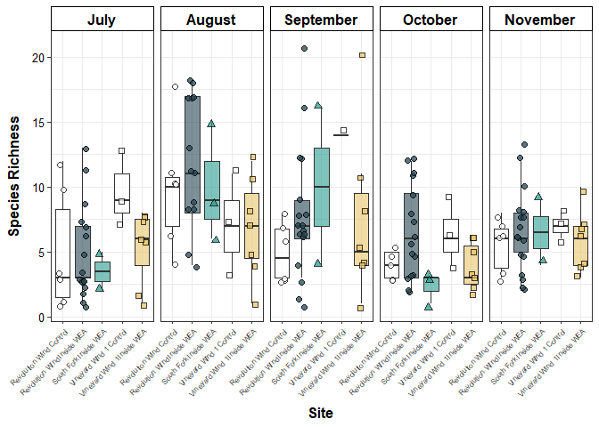
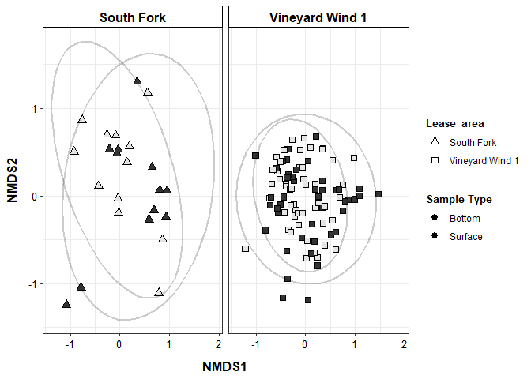

Biodiversity statistics
================

# Load libraries

``` r
library(ggplot2) ## for plotting
library(dplyr) ## for data table manipulation
```

    ## 
    ## Attaching package: 'dplyr'

    ## The following objects are masked from 'package:stats':
    ## 
    ##     filter, lag

    ## The following objects are masked from 'package:base':
    ## 
    ##     intersect, setdiff, setequal, union

``` r
library(tidyr) ## for data table manipulation
library(readr) ## for reading in tsv files
library(readxl) ## for reading in excel files
library(stringr) ## for data transformation
library(strex) ## for data transformation
library(writexl) ## for excel output
library(purrr) ## for data transformation
library(tidyverse) ## for data transformation
```

    ## ── Attaching core tidyverse packages ──────────────────────── tidyverse 2.0.0 ──
    ## ✔ forcats   1.0.0     ✔ tibble    3.2.1
    ## ✔ lubridate 1.9.3

    ## ── Conflicts ────────────────────────────────────────── tidyverse_conflicts() ──
    ## ✖ dplyr::filter() masks stats::filter()
    ## ✖ dplyr::lag()    masks stats::lag()
    ## ℹ Use the conflicted package (<http://conflicted.r-lib.org/>) to force all conflicts to become errors

``` r
library(BiodiversityR) ## for biodiversity metrics
```

    ## Loading required package: tcltk
    ## Loading required package: vegan
    ## Loading required package: permute
    ## Loading required package: lattice
    ## This is vegan 2.6-4
    ## BiodiversityR 2.16-1: Use command BiodiversityRGUI() to launch the Graphical User Interface; 
    ## to see changes use BiodiversityRGUI(changeLog=TRUE, backward.compatibility.messages=TRUE)

``` r
## for stats
library(vegan)
library(stats)
library(devtools)
```

    ## Loading required package: usethis
    ## 
    ## Attaching package: 'devtools'
    ## 
    ## The following object is masked from 'package:permute':
    ## 
    ##     check

``` r
#install_github("pmartinezarbizu/pairwiseAdonis/pairwiseAdonis")
library(pairwiseAdonis)
```

    ## Loading required package: cluster

``` r
library(lme4) ## for stats
```

    ## Loading required package: Matrix
    ## 
    ## Attaching package: 'Matrix'
    ## 
    ## The following objects are masked from 'package:tidyr':
    ## 
    ##     expand, pack, unpack

``` r
library(car) ## for stats
```

    ## Loading required package: carData
    ## 
    ## Attaching package: 'car'
    ## 
    ## The following object is masked from 'package:purrr':
    ## 
    ##     some
    ## 
    ## The following object is masked from 'package:dplyr':
    ## 
    ##     recode

``` r
library(stats) ## for stats
```

# Load data

``` r
meta <- read_xlsx("data/metadata/full_metadata.xlsx")
  
data <- read_xlsx("data/results/Relative_abundance_longformat.xlsx") %>% 
  dplyr::select(-Latitude, -Longitude, -`Sequencing Round 1`, -Category, -Common_name) %>%
  spread(Species_name, rel_ab) %>%
  filter(!SampleType == "Blank")

data_matrix <- data %>% dplyr::select(sampleID, `Alopias vulpinus`:`Urophycis sp`) %>%
  column_to_rownames(var = "sampleID")

bottom <- data %>%
  subset(Depth == "Bottom")
bottom_matrix <- bottom %>% dplyr::select(sampleID, `Alopias vulpinus`:`Urophycis sp`) %>%
  column_to_rownames(var = "sampleID")


### no SF 
bottom_noSF <- bottom %>% subset(!Lease_area == "South Fork")

bottom_noSF_matrix <- bottom_noSF %>%
  dplyr::select(sampleID, `Alopias vulpinus`:`Urophycis sp`) %>%
  column_to_rownames(var = "sampleID")

### REVOLUTION WIND control vs inside WEA (bottom sampling)
bottom_REV <- bottom %>% subset(Lease_area == "Revolution Wind")

bottom_REV_matrix <- bottom_REV %>%
  dplyr::select(sampleID, `Alopias vulpinus`:`Urophycis sp`) %>%
  column_to_rownames(var = "sampleID")

### VINEYARD WIND 1 control vs inside WEA (bottom sampling)
bottom_VW <- bottom %>% subset(Lease_area == "Vineyard Wind 1")

bottom_VW_matrix <- bottom_VW %>%
  dplyr::select(sampleID, `Alopias vulpinus`:`Urophycis sp`) %>%
  column_to_rownames(var = "sampleID")
```

## PERMANOVA for beta diversity

``` r
adonis2(data_matrix ~ Month*Depth*SampleType*Lease_area, data = data, method='eu', permutations = 99)
```

    ## Permutation test for adonis under reduced model
    ## Terms added sequentially (first to last)
    ## Permutation: free
    ## Number of permutations: 99
    ## 
    ## adonis2(formula = data_matrix ~ Month * Depth * SampleType * Lease_area, data = data, permutations = 99, method = "eu")
    ##                              Df SumOfSqs      R2       F Pr(>F)   
    ## Month                         4   16.877 0.24549 20.8313   0.01 **
    ## Depth                         1    1.221 0.01776  6.0299   0.01 **
    ## SampleType                    1    0.373 0.00543  1.8431   0.06 . 
    ## Lease_area                    2    1.871 0.02721  4.6178   0.01 **
    ## Month:Depth                   4    2.411 0.03507  2.9758   0.01 **
    ## Month:SampleType              4    1.014 0.01474  1.2511   0.25   
    ## Depth:SampleType              1    0.230 0.00335  1.1371   0.34   
    ## Month:Lease_area              8    3.263 0.04746  2.0138   0.01 **
    ## Depth:Lease_area              1    0.313 0.00455  1.5441   0.12   
    ## SampleType:Lease_area         1    0.301 0.00438  1.4870   0.20   
    ## Month:Depth:SampleType        4    0.891 0.01295  1.0993   0.29   
    ## Month:Depth:Lease_area        3    1.039 0.01511  1.7096   0.02 * 
    ## Month:SampleType:Lease_area   4    0.665 0.00967  0.8207   0.66   
    ## Residual                    189   38.280 0.55682                  
    ## Total                       227   68.747 1.00000                  
    ## ---
    ## Signif. codes:  0 '***' 0.001 '**' 0.01 '*' 0.05 '.' 0.1 ' ' 1

``` r
adonis2(bottom_noSF_matrix ~ Month*SampleType*Lease_area, data = bottom_noSF, method='eu', permutations = 99)
```

    ## Permutation test for adonis under reduced model
    ## Terms added sequentially (first to last)
    ## Permutation: free
    ## Number of permutations: 99
    ## 
    ## adonis2(formula = bottom_noSF_matrix ~ Month * SampleType * Lease_area, data = bottom_noSF, permutations = 99, method = "eu")
    ##                              Df SumOfSqs      R2       F Pr(>F)   
    ## Month                         4   13.506 0.30246 17.5295   0.01 **
    ## SampleType                    1    0.250 0.00560  1.2971   0.22   
    ## Lease_area                    1    1.161 0.02599  6.0260   0.01 **
    ## Month:SampleType              4    0.737 0.01650  0.9563   0.55   
    ## Month:Lease_area              4    1.661 0.03720  2.1559   0.04 * 
    ## SampleType:Lease_area         1    0.286 0.00641  1.4859   0.18   
    ## Month:SampleType:Lease_area   4    0.665 0.01489  0.8630   0.63   
    ## Residual                    137   26.388 0.59096                  
    ## Total                       156   44.653 1.00000                  
    ## ---
    ## Signif. codes:  0 '***' 0.001 '**' 0.01 '*' 0.05 '.' 0.1 ' ' 1

``` r
### Revolution Control vs Inside WEA
adonis2(bottom_REV_matrix ~ Month*SampleType, data = bottom_REV, method='eu', permutations = 99)
```

    ## Permutation test for adonis under reduced model
    ## Terms added sequentially (first to last)
    ## Permutation: free
    ## Number of permutations: 99
    ## 
    ## adonis2(formula = bottom_REV_matrix ~ Month * SampleType, data = bottom_REV, permutations = 99, method = "eu")
    ##                   Df SumOfSqs      R2       F Pr(>F)   
    ## Month              4  12.1018 0.38754 16.4452   0.01 **
    ## SampleType         1   0.3182 0.01019  1.7296   0.10 . 
    ## Month:SampleType   4   0.5940 0.01902  0.8072   0.70   
    ## Residual          99  18.2132 0.58325                  
    ## Total            108  31.2272 1.00000                  
    ## ---
    ## Signif. codes:  0 '***' 0.001 '**' 0.01 '*' 0.05 '.' 0.1 ' ' 1

``` r
### VW1 Control vs Inside WEA
adonis2(bottom_VW_matrix ~ Month*SampleType, data = bottom_VW, method='eu', permutations = 99)
```

    ## Permutation test for adonis under reduced model
    ## Terms added sequentially (first to last)
    ## Permutation: free
    ## Number of permutations: 99
    ## 
    ## adonis2(formula = bottom_VW_matrix ~ Month * SampleType, data = bottom_VW, permutations = 99, method = "eu")
    ##                  Df SumOfSqs      R2      F Pr(>F)   
    ## Month             4   3.1032 0.25314 3.6064   0.01 **
    ## SampleType        1   0.1920 0.01566 0.8926   0.43   
    ## Month:SampleType  4   0.7890 0.06436 0.9169   0.62   
    ## Residual         38   8.1745 0.66683                 
    ## Total            47  12.2587 1.00000                 
    ## ---
    ## Signif. codes:  0 '***' 0.001 '**' 0.01 '*' 0.05 '.' 0.1 ' ' 1

## NMDS for season

``` r
vare.mds <- metaMDS(bottom_noSF_matrix, distance = "bray")
```

    ## Run 0 stress 0.2305453 
    ## Run 1 stress 0.2385322 
    ## Run 2 stress 0.2306189 
    ## ... Procrustes: rmse 0.04604098  max resid 0.2591664 
    ## Run 3 stress 0.2219132 
    ## ... New best solution
    ## ... Procrustes: rmse 0.03878119  max resid 0.2563417 
    ## Run 4 stress 0.2311838 
    ## Run 5 stress 0.2351702 
    ## Run 6 stress 0.2219786 
    ## ... Procrustes: rmse 0.006951184  max resid 0.08533041 
    ## Run 7 stress 0.2393454 
    ## Run 8 stress 0.2303233 
    ## Run 9 stress 0.2301549 
    ## Run 10 stress 0.2240029 
    ## Run 11 stress 0.2319168 
    ## Run 12 stress 0.2292906 
    ## Run 13 stress 0.2358205 
    ## Run 14 stress 0.2312045 
    ## Run 15 stress 0.2286887 
    ## Run 16 stress 0.2400275 
    ## Run 17 stress 0.2297627 
    ## Run 18 stress 0.2298018 
    ## Run 19 stress 0.2316352 
    ## Run 20 stress 0.2402032 
    ## *** Best solution was not repeated -- monoMDS stopping criteria:
    ##      1: no. of iterations >= maxit
    ##     16: stress ratio > sratmax
    ##      3: scale factor of the gradient < sfgrmin

``` r
data.scores <- as.data.frame(scores(vare.mds)$sites) %>%
  rownames_to_column(var = "sampleID") %>%
  left_join(., meta, by = "sampleID")

mean_data <- data.scores %>%
  mutate(Month = factor(Month, levels = c("July", "August", "September", "October", "November"))) %>%
  group_by(Month, Lease_area) %>%
  summarise(meanNMDS1 = mean(NMDS1), meanNMDS2 = mean(NMDS2)) %>%
  ungroup()  
```

    ## `summarise()` has grouped output by 'Month'. You can override using the
    ## `.groups` argument.

For season

``` r
### plot 
data.scores %>%
  mutate(Month = factor(Month, levels = c("July", "August", "September", "October", "November"))) %>%
  
  ggplot(., aes(x=NMDS1, y=NMDS2, shape=Lease_area, linetype = SampleType)) +
  
  geom_point(aes(fill=SampleType), fill_alpha = 0.1, size=2.5) +
  stat_ellipse(level = 0.95, size=1, alpha=0.2) +
  
  theme_bw() + 
  #guides(color = guide_legend(override.aes = list(alpha = 1))) +
  labs(shape = "Lease area", fill = "Sample Type") +
  
  scale_shape_manual(values = c(21,22)) +
  scale_fill_manual(values = c("white", "grey70")) +
  scale_linetype_manual(values = c("solid", "dashed")) +
  
  theme(
    axis.title.y = element_text(margin = margin(t = 0, r = 10, b = 0, l = 0), size=12, face="bold"),
    axis.title.x = element_text(margin = margin(t = 10, r = 0, b = 0, l = 0), size=12, face="bold"),
    axis.text.y = element_text(colour = 'black', size = 10),
    axis.text.x = element_text(colour = 'black', size = 10),
    legend.title = element_text(margin = margin(t = 0, r = 0, b = 5, l = 0), size=10, color="black", face="bold"),
    strip.text.x = element_text(color = "black", face = "bold", size = 12),
    strip.background = element_rect(color= "black", fill = "white")
  ) + 
  
  facet_wrap(~Lease_area)
```

    ## Warning in geom_point(aes(fill = SampleType), fill_alpha = 0.1, size = 2.5):
    ## Ignoring unknown parameters: `fill_alpha`

    ## Warning: Using `size` aesthetic for lines was deprecated in ggplot2 3.4.0.
    ## ℹ Please use `linewidth` instead.
    ## This warning is displayed once every 8 hours.
    ## Call `lifecycle::last_lifecycle_warnings()` to see where this warning was
    ## generated.

<!-- -->

``` r
ggsave("data/results/NMDS_controlvinside.png", width = 6, height = 4)
```

For inside vs outside WEA

``` r
### plot 
data.scores %>%
  mutate(Month = factor(Month, levels = c("July", "August", "September", "October", "November"))) %>%
  
  ggplot(., aes(x=NMDS1, y=NMDS2, fill=Month, color=Month, shape=Lease_area)) +
  
  geom_point(alpha=0.2, size=2.5, stroke=0.85) +
  stat_ellipse(level = 0.95, size=1, alpha=0.2) +
  
  geom_path(data=mean_data, aes(x=meanNMDS1, y=meanNMDS2, group = Lease_area), color="black", linetype="solid",
            size=1.15, arrow = arrow(length = unit(0.3, "cm"))) +
  geom_point(data=mean_data, aes(x=meanNMDS1, y=meanNMDS2), color="black", size=4) +

  theme_bw() + 
  guides(fill = "none", color = guide_legend(override.aes = list(alpha = 1))) +
  labs(shape = "Lease area") +

   scale_fill_manual(values = c("#0f4c5c", "#e36414", "#fb8b24", "#9a031e", "#5f0f40")) +
   scale_color_manual(values = c("#0f4c5c", "#e36414", "#fb8b24", "#9a031e", "#5f0f40")) +
  
  scale_shape_manual(values = c(21,22)) +
  theme(
    axis.title.y = element_text(margin = margin(t = 0, r = 10, b = 0, l = 0), size=12, face="bold"),
    axis.title.x = element_text(margin = margin(t = 10, r = 0, b = 0, l = 0), size=12, face="bold"),
    axis.text.y = element_text(colour = 'black', size = 10),
    axis.text.x = element_text(colour = 'black', size = 10),
    legend.title = element_text(margin = margin(t = 0, r = 0, b = 5, l = 0), size=10, color="black", face="bold"),
    strip.text.x = element_text(color = "black", face = "bold", size = 12),
    strip.background = element_rect(color= "black", fill = "white")
  ) + 
  facet_wrap(~Lease_area, ncol=2)
```

    ## Warning in MASS::cov.trob(data[, vars]): Probable convergence failure

<!-- -->

``` r
ggsave("data/results/NMDS.png", width = 8.5, height = 4)
```

    ## Warning in MASS::cov.trob(data[, vars]): Probable convergence failure

# Alpha diversity

``` r
alpha_df <- read_xlsx("data/results/Relative_abundance_longformat.xlsx") %>%
  group_by(Month, Site, Depth) %>%
  filter(!Category == "unassigned") %>%
  filter(!Category == "Livestock") %>%
  filter(!Category == "Human") %>%
  filter(!Category == "Other") %>%
  filter(rel_ab > 0) %>%
  mutate(richness = n_distinct(Species_name)) %>%
  dplyr::select(Month, Site, Depth, SampleType, Lease_area, richness) %>%
  subset(Depth == "Bottom") %>%
  distinct()

alpha_df %>%
  mutate(Month = factor(Month, levels = c("July", "August", "September", "October", "November"))) %>%
  filter(!is.na(Lease_area)) %>%
  unite(sample_group, Lease_area, SampleType, sep = " ", remove=F) %>%
  
  ggplot(., aes(x=sample_group, y=richness)) +
    theme_bw() +
    xlab("Site") + 
    ylab("Species Richness") + 
    geom_boxplot(aes(fill=sample_group), alpha=0.6, outlier.shape = NA) + 
    geom_jitter(aes(fill=sample_group, shape=Lease_area), size=2, color="black", alpha=0.75, width=0.2) +
  #labs(shape = "Lease area", fill = "Lease area") +
  facet_wrap(~Month, ncol=5) +
  scale_fill_manual(values = c("white", "#264653", "#2a9d8f", "white", "#e9c46a"), name = "Lease Area") +
  scale_shape_manual(values = c(21,24,22)) +
   theme(
    axis.title.y = element_text(margin = margin(t = 0, r = 10, b = 0, l = 0), size=12, face="bold"),
    axis.title.x = element_text(margin = margin(t = 10, r = 0, b = 0, l = 0), size=12, face="bold"),
    axis.text.y = element_text(colour = 'black', size = 10),
    axis.text.x = element_text(angle = 45, size=6, color="grey25", hjust = 1),
    legend.title = element_text(margin = margin(t = 0, r = 0, b = 5, l = 0), size=10, color="black", face="bold"),
    strip.text.x = element_text(color = "black", face = "bold", size = 12),
    strip.background = element_rect(color= "black", fill = "white"),
    legend.position = "none"
  )
```

<!-- -->

``` r
ggsave("data/results/species_richness.png", width=10, height=5)

alpha_df %>%
  mutate(Month = factor(Month, levels = c("July", "August", "September", "October", "November"))) %>%
  filter(!is.na(Lease_area)) %>%
  unite(sample_group, Lease_area, SampleType, sep = " ", remove=F) %>%
  
  ggplot(., aes(x=Month, y=richness)) +
    theme_bw() +
    xlab("Month") + 
    ylab("Species Richness") + 
    geom_boxplot(aes(fill=sample_group), alpha=0.6, outlier.shape = NA) + 
    geom_jitter(aes(fill=sample_group, shape=Lease_area), size=2, color="black", alpha=0.75, width=0.2) +
  #labs(shape = "Lease area", fill = "Lease area") +
  facet_wrap(~sample_group, ncol=5, labeller = label_wrap_gen(width = 16)) +
  scale_fill_manual(values = c("white", "#264653", "#2a9d8f", "white", "#e9c46a"), name = "Lease Area") +
  scale_shape_manual(values = c(21,24,22)) +
   theme(
    axis.title.y = element_text(margin = margin(t = 0, r = 10, b = 0, l = 0), size=10, face="bold"),
    axis.title.x = element_text(margin = margin(t = 10, r = 0, b = 0, l = 0), size=10, face="bold"),
    axis.text.y = element_text(colour = 'black', size = 10),
    axis.text.x = element_text(angle = 45, size=6, color="grey25", hjust = 1),
    legend.title = element_text(margin = margin(t = 0, r = 0, b = 5, l = 0), size=10, color="black", face="bold"),
    strip.text.x = element_text(color = "black", face = "bold", size = 10),
    strip.background = element_rect(color= "black", fill = "white"),
    legend.position = "none"
  )
```

<!-- -->

``` r
ggsave("data/results/species_richness_bysite.png", width=10, height=5)
```

``` r
alpha_df_stats <- alpha_df %>%
  unite(sample_group, Lease_area, SampleType, sep = " ", remove=F) %>%
  subset(sample_group == "Vineyard Wind 1 Control")

aov <- aov(richness ~ Month, data = alpha_df_stats)
Anova(aov, type = "III")
```

    ## Anova Table (Type III tests)
    ## 
    ## Response: richness
    ##              Sum Sq Df F value   Pr(>F)   
    ## (Intercept) 147.000  1 18.0000 0.002827 **
    ## Month        58.667  4  1.7959 0.222906   
    ## Residuals    65.333  8                    
    ## ---
    ## Signif. codes:  0 '***' 0.001 '**' 0.01 '*' 0.05 '.' 0.1 ' ' 1

### PERMANOVA for bottom surface water

``` r
surface_bottom_sites <- data %>% filter(!is.na(Depth)) %>% subset(Depth == "Surface") %>%
  dplyr::select(Site) %>% distinct()

data_SvB <- data %>% filter(Site %in% surface_bottom_sites$Site) %>%
  unite(sample_group, Lease_area, SampleType, sep = " ", remove=F)
data_SvB_matrix <- data_SvB %>% dplyr::select(sampleID, `Alopias vulpinus`:`Urophycis sp`) %>%
  column_to_rownames(var = "sampleID")

adonis2(data_SvB_matrix ~ Month*Lease_area*Depth, data = data_SvB, method='eu', permutations = 99)
```

    ## Permutation test for adonis under reduced model
    ## Terms added sequentially (first to last)
    ## Permutation: free
    ## Number of permutations: 99
    ## 
    ## adonis2(formula = data_SvB_matrix ~ Month * Lease_area * Depth, data = data_SvB, permutations = 99, method = "eu")
    ##                         Df SumOfSqs      R2      F Pr(>F)   
    ## Month                    4    6.791 0.18850 7.5392   0.01 **
    ## Lease_area               1    0.686 0.01903 3.0452   0.01 **
    ## Depth                    1    0.996 0.02764 4.4225   0.01 **
    ## Month:Lease_area         4    1.585 0.04399 1.7594   0.01 **
    ## Month:Depth              4    2.017 0.05598 2.2392   0.01 **
    ## Lease_area:Depth         1    0.336 0.00932 1.4909   0.13   
    ## Month:Lease_area:Depth   3    1.098 0.03047 1.6250   0.02 * 
    ## Residual               100   22.519 0.62506                 
    ## Total                  118   36.028 1.00000                 
    ## ---
    ## Signif. codes:  0 '***' 0.001 '**' 0.01 '*' 0.05 '.' 0.1 ' ' 1

``` r
vare.mds_SvB <- metaMDS(data_SvB_matrix, distance = "bray")
```

    ## Run 0 stress 0.2333951 
    ## Run 1 stress 0.2389162 
    ## Run 2 stress 0.2434082 
    ## Run 3 stress 0.2342183 
    ## Run 4 stress 0.2342936 
    ## Run 5 stress 0.2473212 
    ## Run 6 stress 0.2415531 
    ## Run 7 stress 0.233016 
    ## ... New best solution
    ## ... Procrustes: rmse 0.04100606  max resid 0.2498842 
    ## Run 8 stress 0.2333269 
    ## ... Procrustes: rmse 0.04664914  max resid 0.2636221 
    ## Run 9 stress 0.2358578 
    ## Run 10 stress 0.2355003 
    ## Run 11 stress 0.2450391 
    ## Run 12 stress 0.2433568 
    ## Run 13 stress 0.2430579 
    ## Run 14 stress 0.2392529 
    ## Run 15 stress 0.2295971 
    ## ... New best solution
    ## ... Procrustes: rmse 0.06212441  max resid 0.3107799 
    ## Run 16 stress 0.2356291 
    ## Run 17 stress 0.2376497 
    ## Run 18 stress 0.2405856 
    ## Run 19 stress 0.2329632 
    ## Run 20 stress 0.2438165 
    ## *** Best solution was not repeated -- monoMDS stopping criteria:
    ##      2: no. of iterations >= maxit
    ##     18: stress ratio > sratmax

``` r
data.scores_SvB <- as.data.frame(scores(vare.mds_SvB)$sites) %>%
  rownames_to_column(var = "sampleID") %>%
  left_join(., meta, by = "sampleID")
```

Plot

``` r
data.scores_SvB %>%
  unite(sample_group, Lease_area, SampleType, sep = " ", remove=F) %>%
  mutate(Month = factor(Month, levels = c("July", "August", "September", "October", "November"))) %>%
  
  ggplot(., aes(x=NMDS1, y=NMDS2, shape=Lease_area, fill = Depth)) +
  
  geom_point(size=2.5) +
  stat_ellipse(aes(group=Depth), level = 0.95, size=1, alpha=0.2) +
  
  theme_bw() +
  
  scale_fill_manual(values = c("grey90", "grey20"), name = "Sample Type") +
  scale_shape_manual(values = c(24,22)) +
  
  theme(
    axis.title.y = element_text(margin = margin(t = 0, r = 10, b = 0, l = 0), size=12, face="bold"),
    axis.title.x = element_text(margin = margin(t = 10, r = 0, b = 0, l = 0), size=12, face="bold"),
    axis.text.y = element_text(colour = 'black', size = 10),
    axis.text.x = element_text(colour = 'black', size = 10),
    legend.title = element_text(margin = margin(t = 0, r = 0, b = 5, l = 0), size=10, color="black", face="bold"),
    strip.text.x = element_text(color = "black", face = "bold", size = 12),
    strip.background = element_rect(color= "black", fill = "white")
  ) + 
  
  facet_wrap(~Lease_area)
```

<!-- -->

Alpha diversity for bottom vs surface water

``` r
SvB_alpha <- read_xlsx("data/results/Relative_abundance_longformat.xlsx") %>%
  group_by(Month, Site, Depth) %>%
  filter(Site %in% surface_bottom_sites$Site) %>%
  filter(!Category == "unassigned") %>%
  filter(!Category == "Livestock") %>%
  filter(!Category == "Human") %>%
  filter(!Category == "Other") %>%
  filter(rel_ab > 0) %>%
  mutate(richness = n_distinct(Species_name)) %>%
  dplyr::select(Month, Site, Depth, SampleType, Lease_area, richness) %>%
  distinct()

SvB_alpha %>%
  ggplot(., aes(x=Site, y=richness, shape=Lease_area, fill=Depth)) + 
  geom_point(size=2, color="black", alpha=0.75) +
  facet_wrap(~Month) +
  theme_bw() +
  scale_fill_manual(values = c("darkblue", "lightblue"), name = "Sample Type") +
  scale_shape_manual(values = c(24,22), name = "Lease area")
```

<!-- -->

``` r
data_SvB_overlap <- read_xlsx("data/results/Rawreads_longformat.xlsx") %>%
  filter(Site %in% surface_bottom_sites$Site) %>%
  filter(!Category == "unassigned") %>%
  filter(!Category == "Livestock") %>%
  filter(!Category == "Human") %>%
  filter(!Category == "Other")
  

bottom_spp <- data_SvB_overlap %>% subset(Depth == "Bottom") %>% dplyr::select(Species_name, Common_name) %>% distinct()
surface_spp <- data_SvB_overlap %>% subset(Depth == "Surface") %>% dplyr::select(Species_name, Common_name) %>% distinct()
 
## Bottom total = 57
## Surface total = 64
### Both = 50  
### Bottom only = 8
### Surface only = 15

both_SB <- intersect(bottom_spp$Species_name, surface_spp$Species_name) 

bottom_only <- anti_join(bottom_spp, surface_spp) ## 8 species unique to bottom
```

    ## Joining with `by = join_by(Species_name, Common_name)`

``` r
surface_only <- anti_join(surface_spp, bottom_spp) ## 15 species unique to bottom
```

    ## Joining with `by = join_by(Species_name, Common_name)`
