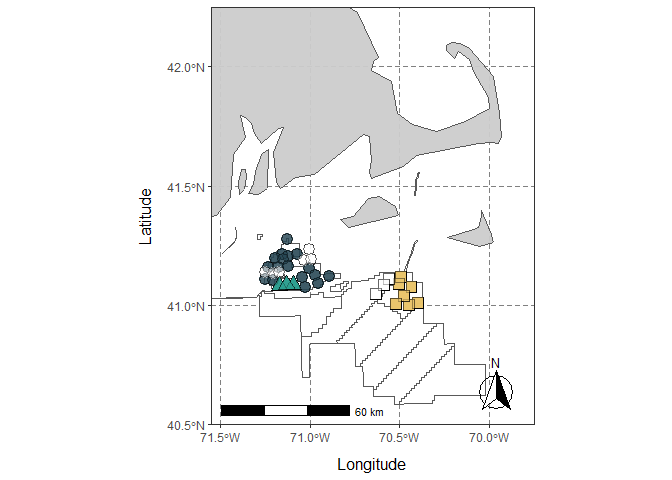

Biodiversity statistics
================

# Load libraries

``` r
library(ggplot2) ## for plotting
library(dplyr) ## for data table manipulation
```

    ## 
    ## Attaching package: 'dplyr'

    ## The following objects are masked from 'package:stats':
    ## 
    ##     filter, lag

    ## The following objects are masked from 'package:base':
    ## 
    ##     intersect, setdiff, setequal, union

``` r
library(tidyr) ## for data table manipulation
library(readr) ## for reading in tsv files
library(readxl) ## for reading in excel files
library(stringr) ## for data transformation
library(strex) ## for data transformation
library(writexl) ## for excel output
library(purrr) ## for data transformation
library(tidyverse) ## for data transformation
```

    ## ── Attaching core tidyverse packages ──────────────────────── tidyverse 2.0.0 ──
    ## ✔ forcats   1.0.0     ✔ tibble    3.2.1
    ## ✔ lubridate 1.9.3

    ## ── Conflicts ────────────────────────────────────────── tidyverse_conflicts() ──
    ## ✖ dplyr::filter() masks stats::filter()
    ## ✖ dplyr::lag()    masks stats::lag()
    ## ℹ Use the conflicted package (<http://conflicted.r-lib.org/>) to force all conflicts to become errors

``` r
## for mapping
library(sf)
```

    ## Linking to GEOS 3.11.2, GDAL 3.8.2, PROJ 9.3.1; sf_use_s2() is TRUE

``` r
library(rnaturalearth)
library(rnaturalearthdata)
```

    ## 
    ## Attaching package: 'rnaturalearthdata'
    ## 
    ## The following object is masked from 'package:rnaturalearth':
    ## 
    ##     countries110

``` r
library("ggspatial")
library(terra)  # spatial (raster + vector) data analysis and mapping
```

    ## terra 1.7.71
    ## 
    ## Attaching package: 'terra'
    ## 
    ## The following object is masked from 'package:tidyr':
    ## 
    ##     extract

``` r
library(tidyterra)
```

    ## 
    ## Attaching package: 'tidyterra'
    ## 
    ## The following object is masked from 'package:stats':
    ## 
    ##     filter

``` r
library(rnaturalearth)  # more spatial data download 
```

# Load data

``` r
meta <- read_xlsx("data/metadata/full_metadata.xlsx") %>%
  filter(!is.na(Latitude))

## all files need to be with the shp in this folder (e.g., .sbx, .sbn)
WindLeaseAreas <- terra::vect("data/metadata/Wind_lease_areas/Wind_Lease_Outlines_11_16_2023.shp")
```

## Sample location

Finding max and min map

``` r
min(meta$Latitude); max(meta$Latitude) ## 41.00194 - 41.2782
```

    ## [1] 41.00194

    ## [1] 41.2782

``` r
min(meta$Longitude); max(meta$Longitude) ## -71.2506 - -70.39897
```

    ## [1] -71.2506

    ## [1] -70.39897

``` r
world <- ne_countries(scale = "medium", returnclass = "sf")
```

# Plot

``` r
ggplot(data = world) +
  geom_sf(fill= "grey80", alpha=0.95) +
  
  geom_spatvector(data=WindLeaseAreas, fill = "white") +
  
  # annotate(geom = "label", x = -71, y = 41.4, label = "Revolution Wind",
  #          label.size = NA, fontface = "italic", color = "#264653", size = 6, fill=NA) +
  # 
  # annotate(geom = "label", x = -71.2, y = 40.95, label = "South Fork",
  #          label.size = NA, fontface = "italic", color = "#2a9d8f", size = 6, fill=NA) +
  # 
  # annotate(geom = "label", x = -70.4, y = 40.9, label = "Vineyard Wind 1",
  #          label.size = NA, fontface = "italic", color = "#BB9E53", size = 6, fill=NA) +
  
  geom_point(data=meta %>% unite(fill, SampleType, Lease_area, sep = " ", remove = FALSE), 
             
             aes(x=Longitude, y=Latitude, fill=fill, shape=Lease_area), 
             size=4, alpha=0.35) +
  theme_bw() +
  annotation_scale(location = "bl", width_hint = 0.5) +
  annotation_north_arrow(location = "br", which_north = "true", style = north_arrow_fancy_orienteering) +
    
  xlab("Longitude") + ylab("Latitude") +
  coord_sf(xlim = c(-71.55, -69.75), 
           ylim = c(40.5, 42.25), expand = FALSE) +
    
  theme(panel.grid.major = element_line(color = gray(.5), linetype = "dashed", linewidth = 0.5), 
        legend.position="none",
        legend.text = element_text(size=10),
          legend.title = element_text(size=10, face="bold"),
          legend.background = element_blank(),
          legend.box.background = element_blank(),
          legend.key = element_rect(fill = "transparent", color = "transparent"),
        panel.background = element_rect(fill = "white"),
        axis.title.y = element_text(margin = margin(t = 0, r = 10, b = 0, l = 0), size=12),
        axis.title.x = element_text(margin = margin(t = 10, r = 0, b = 0, l = 0), size=12)) +
  
  scale_fill_manual(values = c("white", "white", "#264653", "#2a9d8f", "#e9c46a"), name = "Lease Area") +
  scale_shape_manual(values = c(21,24,22))
```

<!-- -->

``` r
ggsave("data/metadata/map.png", width = 6, height=7)
```
